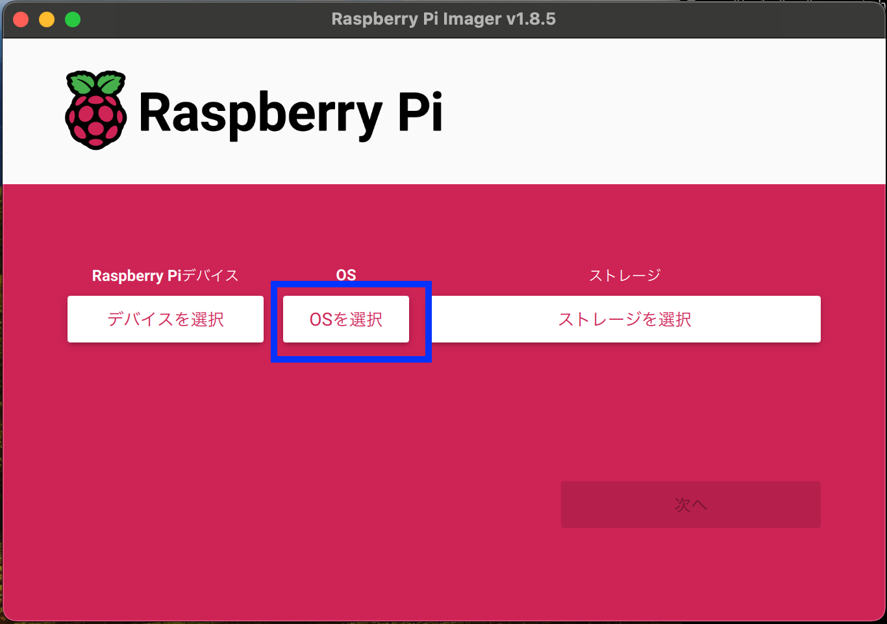
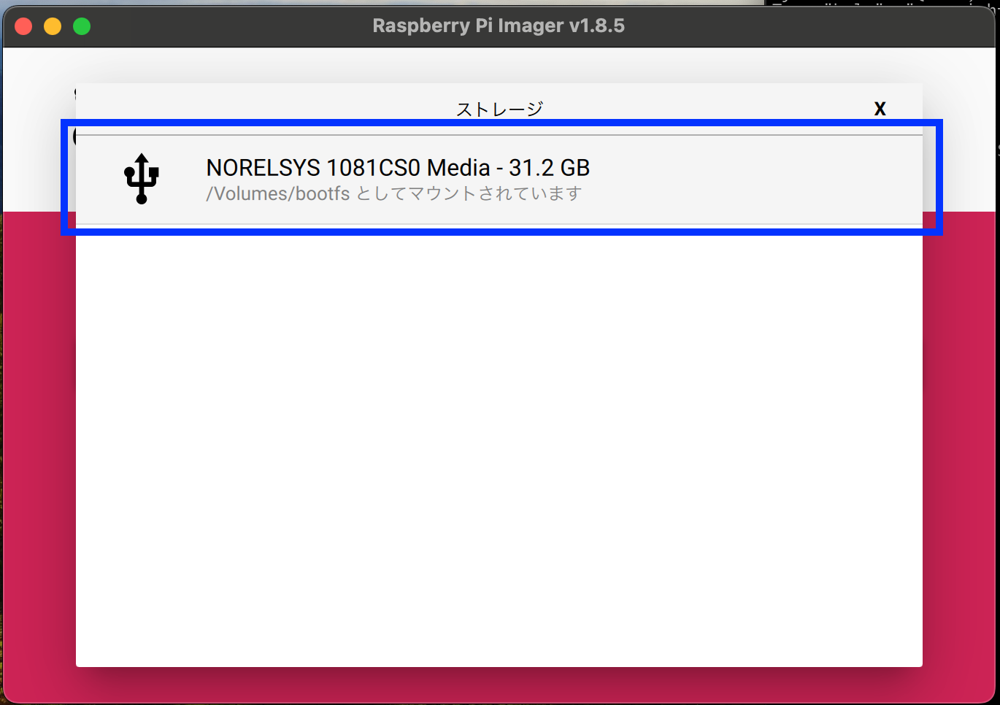

# ■ cassys (カシス)

Cloud Attach Storage System

S3をバックエンドにもつファイルサーバー機能を有した RaspberryPi OS を生成するコマンドラインツールです。


# ■ 使い方

## 1.前準備

### # dockerのインストール

dockerをインストールしてください。

https://docs.docker.com/engine/install/

ログインユーザーからdockerコマンドを操作できるようにします。

```bash
# ログインユーザーをdockerグループに追加します。
usermod -aG docker $(whoami)

# このコマンドの実行に成功したら一度ログアウトします。
exit

# 再度ログインしてdockerコマンドを実行してみましょう
docker ps
```

### # S3バケットとIAMユーザーの作成

1. バックエンドとなるs3バケットを作成します。
1. `AmazonS3FullAccess` ポリシーを持つIAMユーザーを作成します。
1. 作成したIAMユーザーでアクセスキーを発行します。

### # リポジトリのクローン

```bash
git clone https://github.com/ng3rdstmadgke/cassys.git

cd cassys
```

## 2. 設定ファイルの準備

ラズベリーパイイメージの生成に必要な設定ファイルを用意します。


```bash
# 設定ファイルをコピー
cp setting/sample.yml setting/my-setting.yml

# 設定ファイルの編集
vim setting/my-setting.yml
```

`setting/my-setting.yml`


```yml
---
mnt_bucket: "MY_BUCKET_NAME"  # マウントするS3バケット名
aws_credential:  # IAMユーザーのアクセスキー
  aws_accesskey_id: "xxxxxxxxxxxxxxxxxxxx"
  aws_secret_accesskey: "xxxxxxxxxxxxxxxxxxxxxxxxxxxxxxxxxxxxxxxx"
smb:  # sambaサーバの設定
  user: "cassys"  # sambaサーバに接続するユーザ名(任意)
  password: "xxxxxxxx"  # sambaサーバに接続するスワード(任意)
dhcpcd:
  ip: "192.168.50.110/24"  # ラズベリーパイのIPアドレス(任意)
  router_ip: "192.168.50.1"  # ラズベリーパイが参加するネットワークのルーターのIPアドレス
```

## 3. イメージ生成

ラズベリーパイイメージを生成します。  
OSは64bit, 32bitから選択できます。


### # 64bitOSのイメージ

```bash
# イメージ生成
# 30分程かかります
./bin/build.sh arm64 setting/my-setting.yml

# 出来上がったイメージ
ls .build/output-arm-image/arm64_cassys.img.xz
```

### # 32bitOSのイメージ

```bash
# イメージ生成
# 30分程かかります
./bin/build.sh armhf setting/my-setting.yml

# 完成したイメージ
ls .build/output-arm-image/armhf_cassys.img.xz
```

## 4. SDカードにイメージを書き込む

イメージは `Raspberry Pi Imager` を利用して書き込みます。

- [Raspberry Pi Imager のダウンロード](https://www.raspberrypi.com/software/)

### # デバイスの選択

利用するラズベリーパイを指定します。


### # OSの選択

OSを選択します。



「Use custom」をクリックして、先程生成したイメージを選択します。


### # ストレージの選択

イメージを書き込むSDカードを選択します。




すべての項目を選択し終わったら「次へ」をクリック


### # OSのカスタム設定

ラズパイOSの初期設定を行います。


- ホスト名  
任意のホスト名を指定します。
- ユーザー名とパスワードの設定  
ラズベリーパイにログインするための任意のユーザー名とパスワードを指定します。
- Wi-Fiの設定  
ラズベリーパイが接続するWi-Fiを指定します。
- ロケールの設定  
タイムゾーン: 日本にいるなら `Asia/Tokyo` を設定します。  
キーボードレイアウト: jis配列を利用しているなら `jp` を指定します。  


設定を保存したら 「はい」を選択します。


すべての設定が完了したら書き込みを行います。


## 5. 接続

Finder (windowsの場合はexplorer) を開いて、「OSのカスタム設定 - ホスト名」に設定した名前をクリックし、「別名で接続」をクリックします。


`setting/my-setting.yml` の `smb.user` `smb.password` に設定した情報を入力し、「接続」をクリックします。


`share` をクリックすると、S３バケット名が表示されます。


